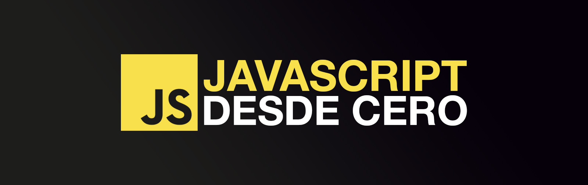

# Hello JavaScript

 

## Curso para aprender el lenguaje de programación JavaScript desde cero y para principiantes

### Proyecto realizado durante emisiones en directo desde [Twitch](https://twitch.tv/mouredev)
> ##### Si consideras útil el curso, apóyalo haciendo "★ Star" en el repositorio. ¡Gracias!

## Curso finalizado (por el momento)

### Una vez editado se subirá como un único vídeo a [YouTube](https://youtube.com/@mouredev). Por el momento puedes ver los directos individuales.
#### El curso continuará con una parte intermedia. Lo anunciaré en redes y actualizaré el repo con el nuevo contenido.

## Clases en vídeo

#### [CLASE 1 | 10/07/2024 | Introducción, instalación, hola mundo y variables](https://www.youtube.com/live/hoULS5isDck?si=qtcStT34Ef8ETBmB&t=915)

Código:

* [00 - Hola Mundo](./Basic/00-helloworld.js)
* [01 - Variables](./Basic/01-variables.js)

#### [CLASE 2 | 17/07/2024 | Tipos de datos, operadores y strings](https://www.youtube.com/live/euVbF1eatEY?si=nHS3QznAlA_C39NK&t=808)

Código:

* [02 - Tipos de datos](./Basic/02-datatypes.js)
* [03 - Ejercicios: Primeros pasos](./Basic/03-beginner-exercises.js)
* [04 - Operadores](./Basic/04-operators.js)
* [05 - Ejercicios: Operadores](./Basic/05-operators-exercises.js)
* [06 - Strings](./Basic/06-strings.js)
* [07 - Ejercicios: Strings](./Basic/07-strings-exercises.js)

#### [CLASE 3 | 24/07/2024 | Condicionales, arrays y sets](https://www.youtube.com/live/XCNjoIoO3Ws?si=3XCjdZ9r41JID-by&t=978)

Código:

* [08 - Condicionales](./Basic/08-conditionals.js)
* [09 - Ejercicios: Condicionales](./Basic/09-conditionals-exercises.js)
* [10 - Array](./Basic/10-array.js)
* [11 - Set](./Basic/11-set.js)

#### [CLASE 4 | 31/07/2024 | Mapas, bucles y funciones](https://www.youtube.com/live/xg1GeHKiNzU?si=oiWHK8bDTZ1c98hF&t=885)

Código:

* [12 - Map](./Basic/12-map.js)
* [13 - Ejercicios: Estructuras](./Basic/13-structures-exercises.js)
* [14 - Bucles](./Basic/14-loops.js)
* [15 - Ejercicios: Bucles](./Basic/15-loops-exercises.js)
* [16 - Funciones](./Basic/16-functions.js)
* [17 - Ejercicios: Funciones](./Basic/17-functions-exercises.js)

#### [CLASE 5 | 07/08/2024 | Objetos, desestructuración, propagación y clases](https://www.youtube.com/live/SBXEpAx_y_Q?si=Sbqqa2-_eGwsUkH-&t=958)

Código:

* [18 - Objetos](./Basic/18-objects.js)
* [19 - Ejercicios: Objetos](./Basic/19-objects-exercises.js)
* [20 - Desestructuración y propagación](./Basic/20-destructuring-spreading.js)
* [21 - Ejercicios: Desestructuración y propagación](./Basic/21-destructuring-spreading-exercises.js)
* [22 - Clases](./Basic/22-classes.js)

#### [CLASE 6 | 15/08/2024 | Clases (continuación) y manejo de errores](https://www.youtube.com/live/8p6SLAIgwZI?si=MS9o7qIhezx9NTQX&t=902)

Código:

* [22 - Clases](./Basic/22-classes.js)
* [23 - Ejercicios: Clases](./Basic/23-classes-exercises.js)
* [24 - Manejo de errores](./Basic/24-error-handling.js)
* [25 - Ejercicios: Manejo de errores](./Basic/25-error-handling-exercises.js)
  

#### [CLASE 7 FINAL | 21/08/2024 | Console y módulos](https://www.youtube.com/live/PAnxhBE5kIE?si=V0F_NsKO9lmhhatu&t=555)

Código:

* [26 - Console](./Basic/26-console-methods.js)
* [27 - Ejercicios: Console](./Basic/27-console-methods-exercises.js)
* [28 - Exportación de módulos](./Basic/28-export-modules.js)
* [29 - Importación de módulos](./Basic/29-import-modules.js)
* [30 - Importación de módulos externos](./Basic/30-import-external-modules.js)
* [31 - Ejercicios: Módulos](./Basic/31-modules-exercises.cjs)
* [package.json módulos](./Basic/package.json)

## Enlaces de interés

* Impacto: [Stack Overflow](https://survey.stackoverflow.co/2023/#most-popular-technologies-language) | [GitHub](https://github.blog/2023-11-08-the-state-of-open-source-and-ai/) | [Índice TIOBE](https://www.tiobe.com/tiobe-index/) | [Google Trends](https://trends.google.es/trends/explore?cat=5&date=today%205-y&q=%2Fm%2F02p97,%2Fm%2F05z1_,%2Fm%2F07sbkfb&hl=es)
* [Historia](https://es.wikipedia.org/wiki/JavaScript)
* [Especificación ECMAScript](https://tc39.es/ecma262/)
* [Documentación Mozilla](https://developer.mozilla.org/es/docs/Web/JavaScript)
* [Documentación W3Schools](https://www.w3schools.com/js/)
* [Documentación JS Info](https://es.javascript.info/)
* [Libro Eloquent JavaScript](https://eloquentjavascript.net/)
* [Playground](https://runjs.app/play)
* [Node.js](https://nodejs.org)
* Exploradores: [Chrome](https://www.google.com/intl/es_es/chrome/) | [Brave](https://brave.com/download/)
* [Visual Studio Code](https://code.visualstudio.com/)
* [Guía de estilo](https://google.github.io/styleguide/jsguide.html)

## Preguntas frecuentes

#### ¿Debo tener conocimientos previos?
Mi idea es que el curso sea desde cero y para principiantes. Pensado para una persona que comienza por primera vez a programar. Es un curso de fundamentos, donde nos centraremos en aprender las bases del lenguaje con JavaScript puro (Vanilla JS). Esto no es un curso para aprender a desarrollar proyectos. Vamos a empezar desde el principio.

Si la acogida de la comunidad es buena, seguiré creando cursos más avanzados.

#### ¿Se subirá el curso a YouTube?
Sí, cuando esté finalizado lo subiré editado y en un único vídeo a mi [canal principal](https://youtube.com/@mouredev). Por el momento puedes ver cada clase independiente.

#### ¿Cuánto durará el curso?
Esta primera parte se centrará en los fundamentos del lenguaje. El curso finalizará cuando se explique todo el temario, es decir, el tiempo que haga falta. Creo que es mucho mejor así que poniendo una fecha límite, así me aseguro de emplear el tiempo que sea necesario para que el aprendizaje sea lo mejor posible.

#### ¿Existe algún lugar donde consultar dudas?
He creado un canal llamado "JavaScript" en el [servidor de Discord](https://discord.gg/mouredev) de la comunidad. Allí puedes consultar dudas y ayudar al resto de miembros. Así nos beneficiamos tod@s.

#### ¿Cómo puedo practicar?
A medida que avance el curso, crearé ficheros de ejercicios para poner en práctica lo aprendido. También puedes realizar los ejercicios de mi web [retosdeprogramacion.com](https://retosdeprogramacion.com).

##  Hola, mi nombre es Brais Moure.
### Freelance full-stack iOS & Android engineer

Soy ingeniero de software desde 2010. Desde 2018 combino mi trabajo desarrollando Apps con la creación de contenido formativo sobre programación y tecnología en diferentes redes sociales como **[@mouredev](https://moure.dev)**.

Si quieres unirte a nuestra comunidad de desarrollo, aprender programación, mejorar tus habilidades y ayudar a la continuidad del proyecto, puedes encontrarnos en:

 
